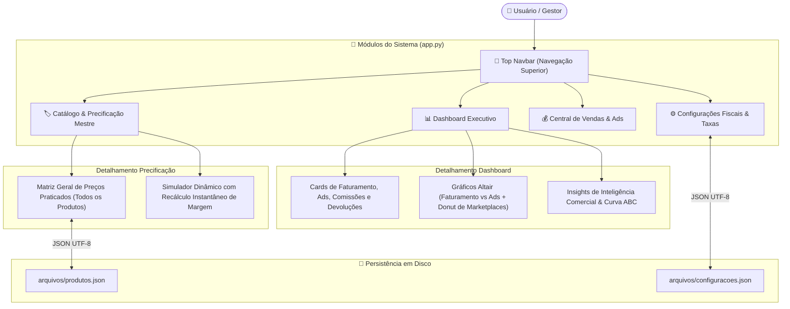

# 📐 Arquitetura do Código (Repaginação) — ORION Enterprise

Este documento descreve a nova arquitetura do aplicativo de gestão ([`app.py`](file:///c:/Users/Lincoln/Desktop/Aplicativo%20de%20gest%C3%A3o/app.py)), desenvolvida com navegação por Top Navbar, gráficos executivos em Altair e precificação mestre unificada.

---

## 📊 Grafo da Nova Estrutura Unificada

---

## 🔗 Links Relacionados (Foam Graph)

* [[index]]: Página Inicial do Foam.
* [[licoes-aprendidas]]: Prevenção de erros e codificação UTF-8 no Windows.
* [[regras-fiscais]]: Alíquotas e margem de ROAS.
