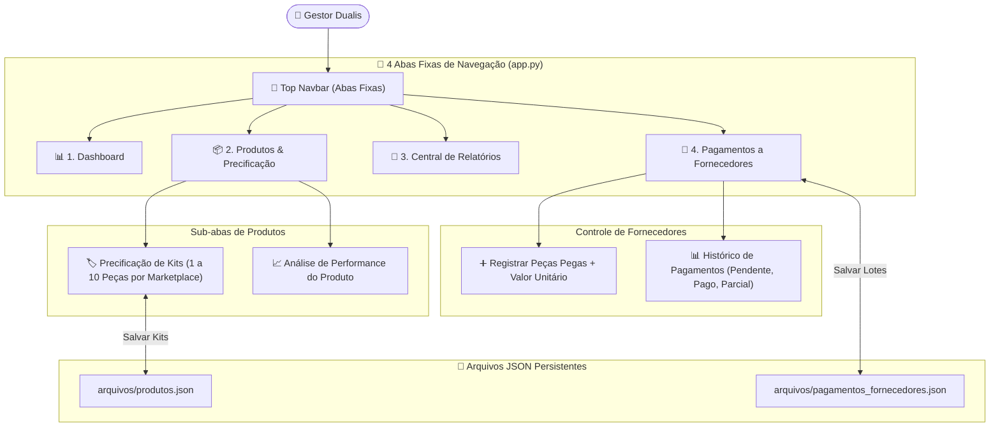

# 📐 Arquitetura do Código (Abas Fixas) — ORION Enterprise

Este documento descreve a nova estrutura com **4 Abas Fixas de Navegação** implementada no [`app.py`](file:///c:/Users/Lincoln/Desktop/Aplicativo%20de%20gest%C3%A3o/app.py).

---

## 🗺️ Estrutura de Abas Fixas

---

## 🔗 Links Relacionados (Foam Graph)

* [[index]]: Página Inicial do Foam.
* [[licoes-aprendidas]]: Prevenção de erros e codificação UTF-8.
