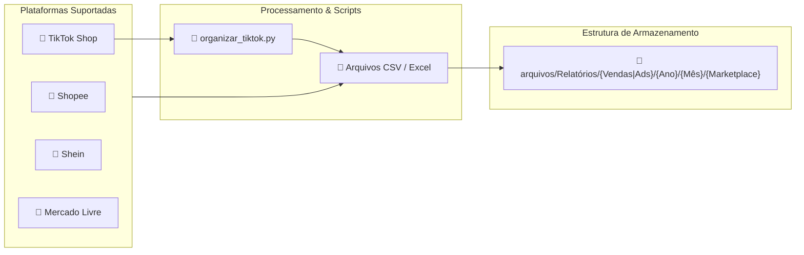

# 🛍️ Integrações com Marketplaces — ORION Enterprise

Este documento descreve como o sistema processa e organiza relatórios das plataformas de e-commerce e anúncios.

---

## 📊 Fluxo de Processamento de Relatórios

---

## 🛠️ Script Auxiliar: `organizar_tiktok.py`

O script [`organizar_tiktok.py`](file:///c:/Users/Lincoln/Desktop/Aplicativo%20de%20gest%C3%A3o/organizar_tiktok.py) limpa e padroniza relatórios baixados do TikTok Ads / TikTok Shop, movendo ou renomeando as colunas para o formato legível pelo [`app.py`](file:///c:/Users/Lincoln/Desktop/Aplicativo%20de%20gest%C3%A3o/app.py).

---

## 🔗 Links Relacionados (Foam Graph)

* [[index]]: Página Inicial.
* [[arquitetura-do-codigo]]: Arquitetura do sistema.
* [[regras-fiscais]]: Impacto das taxas de cada marketplace na margem líquida.
