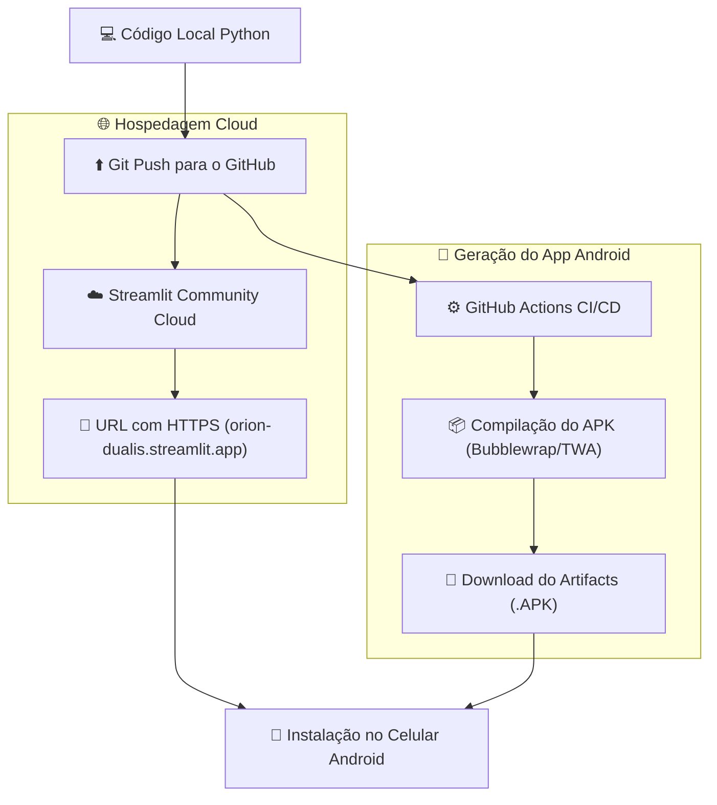

# 📱 Manual de Publicação & Geração de APK Android

Este guia detalha o processo de hospedagem do **ORION Enterprise** na nuvem e o empacotamento do APK Android.

---

## 🔄 Fluxo de Publicação e Compilação

---

## 📑 Passo a Passo Resumido

1. **Subir o Código**: `ENVIAR_GITHUB.bat` ou comandos `git push origin main`.
2. **Hospedar no Streamlit Cloud**: Conectar o repositório em [share.streamlit.io](https://share.streamlit.io).
3. **Download do APK**: Acessar a aba **Actions** no repositório do GitHub e baixar o artefato compilado.

---

## 🔗 Links Relacionados (Foam Graph)

* [[index]]: Página Inicial.
* [[arquitetura-do-codigo]]: Arquitetura do sistema.
* [[integracoes-marketplaces]]: Leitura e upload de planilhas pelo celular.
