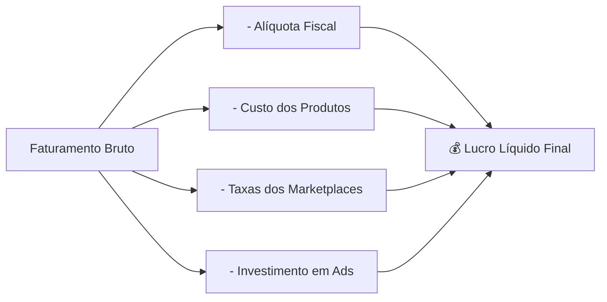

# 📊 Regras Fiscais & ROAS — ORION Enterprise

Este documento contém os parâmetros fiscais e de desempenho de mídia configurados no sistema.

---

## 🏛️ Perfis Tributários Padrão

O sistema suporta presets pré-configurados em `PERFIS_PRESETS_PADRAO`:

| Perfil Tributário | Alíquota Imposto (%) | ROAS Meta Padrão |
| :--- | :--- | :--- |
| **Simples Nacional (~10%)** | 10.0% | 8.0x |
| **MEI (4%)** | 4.0% | 8.0x |
| **MEI Zero (0%)** | 0.0% | 10.0x |
| **Personalizado** | Ajustável | Ajustável |

---

## 🧮 Fórmula de Margem e Cálculo de ROAS

---

## 🔗 Links Relacionados (Foam Graph)

* [[index]]: Página Inicial.
* [[arquitetura-do-codigo]]: Arquitetura do código.
* [[integracoes-marketplaces]]: Taxas e conciliação por canal de venda.
