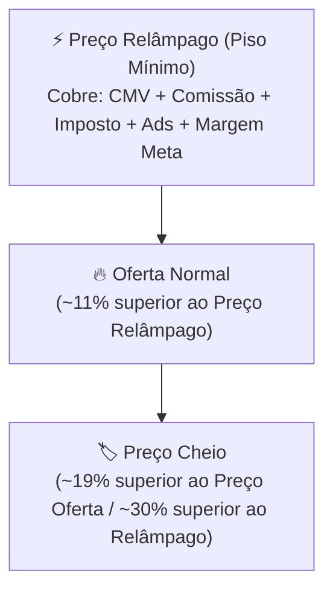

# 📊 Regras de Precificação por Kits & Descontos (Shopee / TikTok)

Este documento registra a estratégia comercial oficial de precificação de kits (1 a 10 unidades) para **Shopee** e **TikTok Shop**.

---

## 🎯 Estrutura dos 3 Níveis de Preço por Kit

---

## 🧮 Fórmulas de Cálculo Automático

1. **Preço Relâmpago ($P_{rel}$):**
   $$P_{rel} = \frac{\text{CMV Kit} + \text{Taxa Fixa}}{1 - \text{Comissão\%} - \text{Imposto\%} - \text{Ads\%} - \text{Margem Meta\%}}$$
2. **Oferta Normal ($P_{oferta}$):**
   $$P_{oferta} = \frac{P_{rel}}{0.89} \quad (\text{Selo de 11\% OFF na Relâmpago})$$
3. **Preço Cheio ($P_{cheio}$):**
   $$P_{cheio} = \frac{P_{oferta}}{0.81} \quad (\text{Selo de 19\% OFF na Oferta})$$

---

## 🔗 Links Relacionados (Foam Graph)

* [[index]]: Página Inicial.
* [[arquitetura-do-codigo]]: Arquitetura do app.py.
